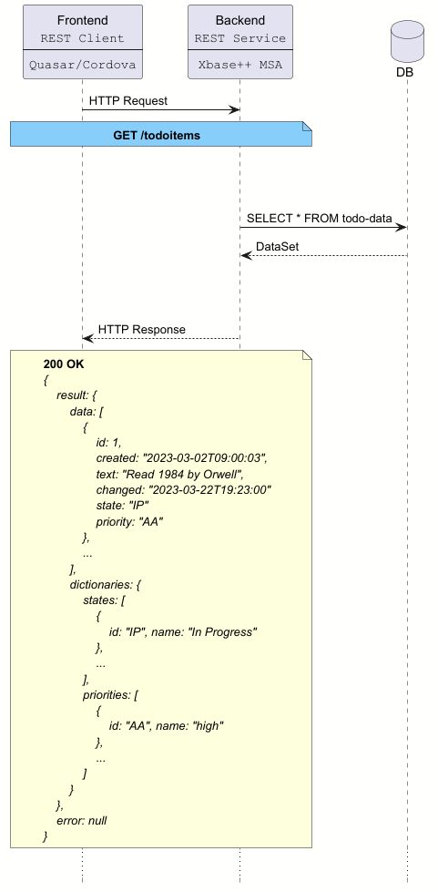

# Mobile App MyTodoEditor

## Overview

**MyTodoEditor** is a sample mobile app that demonstrates CRUD operations against a REST backend.
The frontend is built with [Quasar 2](https://quasar.dev/introduction-to-quasar)
(Vite + Vue 3) and communicates with the [**TodoService** backend](https://github.com/alaska-software/todo-service/blob/main/backend/readme.md).

## Features

- **CRUD Operations**: Create, Read, Update, Delete todo items
- **Modern UI**: Quasar components with Material Design
- **Form Validation**: Input validation before saving
- **Error Handling**: User-friendly error messages
- **Print Support**: Print todo items via Cordova printer plugin

## Tech Stack

### Frontend Framework
- **[Quasar 2](https://quasar.dev)** - Vue.js framework that enables building applications for multiple platforms from a single codebase
    - Web (SPA, PWA, SSR)
    - Mobile (iOS, Android)
    - Desktop (Windows, macOS, Linux)
- **[Vue 3](https://vuejs.org)** - Progressive JavaScript framework using Composition API
- **[Vite](https://vitejs.dev)** - Fast build tool and development server
- **[Cordova](https://cordova.apache.org)** - Mobile application development framework that wraps the web app into native iOS and Android applications

### Backend Framework
- **[Xbase++ MSA Framework](http://guide.alaska-software.net/microservices.html)** - REST microservice architecture for the TodoService backend


## Architecture

The following sequence diagram shows how the frontend loads todo items from the backend:



The frontend (Quasar/Cordova) makes HTTP requests to the backend (Xbase++ MSA), which queries the database and returns data in a standardized envelope format.

## Backend

The backend is [**TodoService**](https://github.com/alaska-software/todo-service/blob/main/backend/readme.md), a REST microservice built with 
the Alaska Software **[MSA Framework for Xbase++](http://guide.alaska-software.net/microservices.html)**. 
It listens on port `9100` by default.

### REST API

| Method | Path              | Description                    |
|--------|-------------------|--------------------------------|
| GET    | `/todoitems`      | Get all todo items             |
| GET    | `/todoitems/{id}` | Get a specific todo item by id |
| POST   | `/todoitems`      | Create a new todo item         |
| PUT    | `/todoitems/{id}` | Update an existing todo item   |
| DELETE | `/todoitems/{id}` | Delete a todo item by id       |

**Note**: All API endpoints return responses in a standardized envelope format (see [Response Envelope](#response-envelope) below).

### Response Envelope

All API responses follow this structure:

```json
{
  "result": {
    "data": [...],
    "dictionaries": {...}
  },
  "error": null
}
```

- **`result`**: Contains the successful response data
  - **`data`**: The main payload (array of todo items, single item, etc.)
  - **`dictionaries`**: Reference data (states, priorities, etc.)
- **`error`**: Contains error information if the request failed, otherwise `null`

This envelope pattern ensures consistent error handling and allows the backend to include reference data alongside the main response.


## Frontend

The frontend is built with [Quasar 2](https://quasar.dev) (Vite + Vue 3). 

### Project Structure

```
src/
├── assets/         # Static assets (images, etc.)
├── boot/           # Boot files (axios configuration)
├── components/     # Reusable Vue components
├── composables/    # Vue 3 Composition API composables
├── constants/      # Application constants (messages, etc.)
├── css/            # Global styles
├── layouts/        # Page layouts
├── pages/          # Page components
├── router/         # Vue Router configuration
├── services/       # API service layer
└── utils/          # Utility functions

src-cordova/        # Cordova app
├── config.xml      # Cordova app configuration
├── platforms/      # Native platform builds (Android, iOS)
└── www/            # Built web app for mobile deployment
```


## Getting Started

### 1. Start the Backend

Download the backend from [TodoService on GitHub](https://github.com/alaska-software/todo-service/tree/main/backend), build and run it.

Verify it is running:

```shell script
curl http://localhost:9100/todoitems
```


Expected response:

```json
{
  "result": {
    "data": [
      {
        "id": 1,
        "created": "2023-01-01T12:00:00",
        "text": "Sample todo",
        "changed": "2023-01-01T12:00:00",
        "state": "open",
        "priority": "high"
      }
    ],
    "dictionaries": {
      "states": [
        {"id": "open", "name": "Open"},
        {"id": "done", "name": "Done"}
      ],
      "priorities": [
        {"id": "high", "name": "High"},
        {"id": "low", "name": "Low"}
      ]
    }
  },
  "error": null
}
```
### 2. Set up and start the Frontend

See [DEVELOPMENT_ANDROID.md](docs/DEVELOPMENT_ANDROID.md) and [DEVELOPMENT_MACOS.md](docs/DEVELOPMENT_MACOS.md) for platform-specific instructions.
