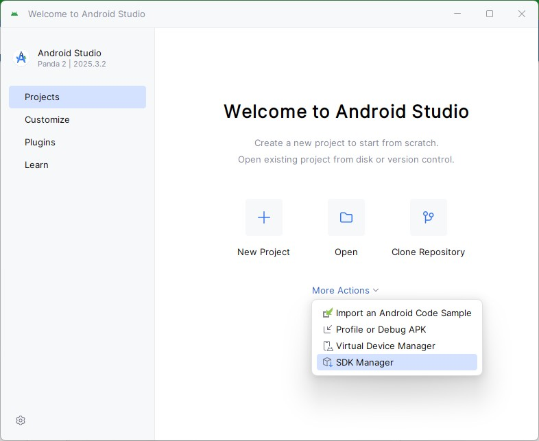
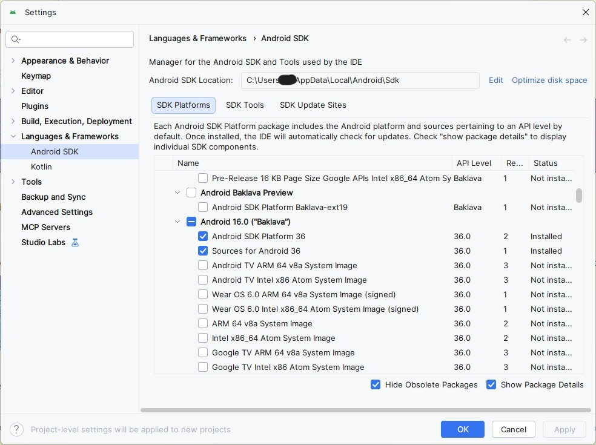
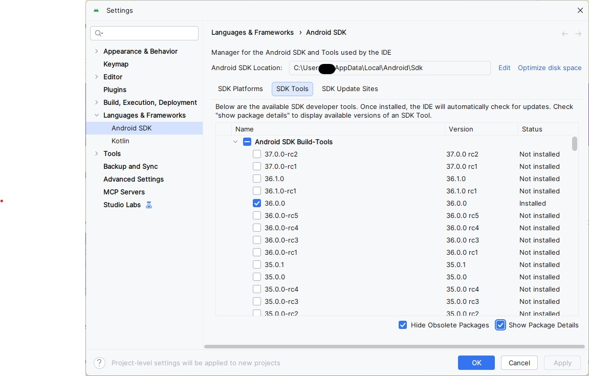
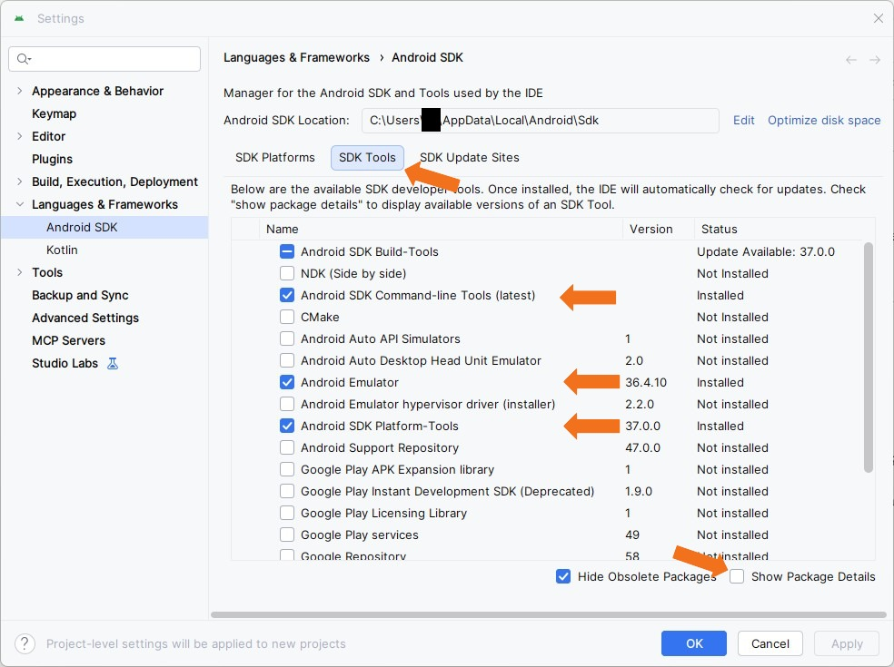
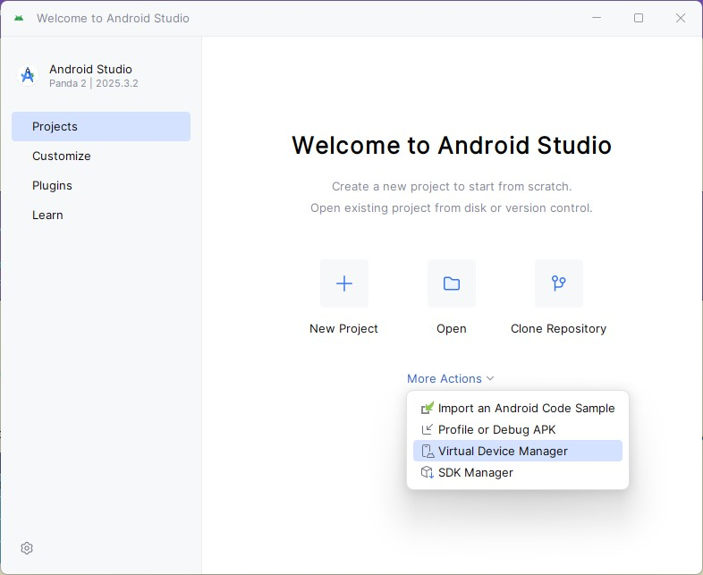
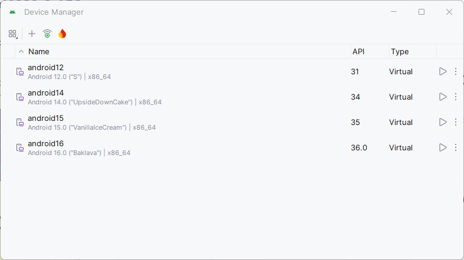
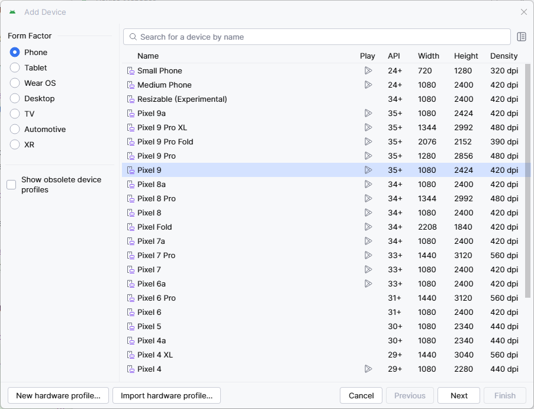
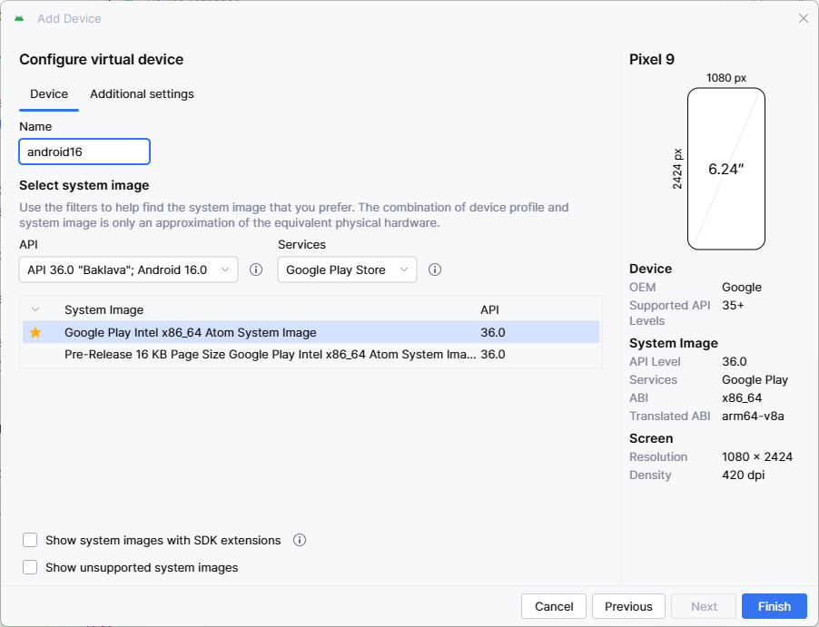

# Setting up Android Development Environment on Windows

This guide provides step-by-step instructions for setting up an Android development environment on Windows
to build and run the Quasar mobile application. It covers installing required tools,
configuring environment variables, setting up Android Studio with the necessary SDK components,
and running the app on Android emulators or physical devices.

## Table of Contents

- [System Requirements](#system-requirements)
- [Set up the development environment](#set-up-the-development-environment)
    - [1. Install prerequisites](#1-install-prerequisites)
        - [1. Java](#1-java)
        - [2. Gradle](#2-gradle)
        - [3. Node.js](#3-nodejs)
    - [2. Install required tools](#2-install-required-tools)
        - [1. Quasar CLI](#1-quasar-cli)
        - [2. Cordova CLI](#2-cordova-cli)
    - [3. Install and set up Android Studio](#3-install-and-set-up-android-studio)
        - [1. Install Android Studio](#1-install-android-studio)
        - [2. Set up Android Studio (SDK)](#2-set-up-android-studio-sdk)
            - [SDK Platforms](#sdk-platforms)
            - [SDK Tools](#sdk-tools)
            - [Set environment variables](#set-environment-variables)
        - [3. Add Android emulators](#3-add-android-emulators)
    - [4. Set environment variables](#4-set-environment-variables)
- [Frontend Setup](#frontend-setup)
- [Run on Android Emulator](#run-on-android-emulator)
- [Run in Browser (Development)](#run-in-browser-development)
- [Android Device Setup and Installation](#android-device-setup-and-installation)
    - [1. Enable Developer Options](#1-enable-developer-options)
    - [2. Enable USB Debugging](#2-enable-usb-debugging)
    - [3. Connect and Authorize](#3-connect-and-authorize)
    - [4. Verify Connection](#4-verify-connection)
    - [5. Build and Install on Android device](#5-build-and-install-on-android-device)
- [Chrome DevTools Debugging](#chrome-devtools-debugging)

## System Requirements

- **Operating System:** Windows 10 (64-bit) or newer
- **RAM:** Minimum 8 GB (16 GB recommended for running emulators)
- **Disk Space:** At least 10 GB free space for Android SDK and tools
- **Processor:** Intel/AMD processor with virtualization support (VT-x/AMD-V)
- **BIOS:** Virtualization must be enabled for Android Emulator

## Set up the development environment

### 1. Install prerequisites

#### 1. Java

- Install [OpenJDK 17.0.0.1](https://jdk.java.net/java-se-ri/17-MR1).

- Create an environment variable `JAVA_HOME` and set it to the location of the Java Development Kit (e.g.,
  `C:\Program Files\Java\jdk-17.0.0.1`).
- Add the path to Java to the environment variable `PATH` (e.g., `%JAVA_HOME%\bin`).

- Verify Java installation:

   ```bash
   java -version
   # Expected: openjdk version "17.0.0.1"
   ```

#### 2. Gradle

- Install [Gradle 9.2.1](https://gradle.org/)
- Create an environment variable `GRADLE_HOME` and set it to the location of the Gradle installation directory (e.g.,
  `C:\Gradle\gradle-9.2.1`).
- Add the path to Gradle to the environment variable `PATH` (e.g., `%GRADLE_HOME%\bin`).
- Verify Gradle installation:

   ```bash
   gradle -v
   # Expected: Gradle 9.2.1
   ```

#### 3. Node.js

- Install [Node.js 24.8.0](https://nodejs.org/en)
- Verify Node.js installation:

   ```bash
   node -v
   # Expected: v24.8.0
   ```

### 2. Install required tools

#### 1. Quasar CLI

Install [Quasar CLI](https://quasar.dev/introduction-to-quasar):

```bash
npm install -g @quasar/cli
```

Verify Quasar installation:

```bash
quasar -v
```

#### 2. Cordova CLI

Install [Cordova CLI](https://cordova.apache.org/docs/en/latest/):

```bash
npm install -g cordova
```

Verify Cordova installation:

```bash
cordova -v
```

### 3. Install and set up Android Studio

#### 1. Install Android Studio

Install [Android Studio](https://developer.android.com/studio).

#### 2. Set up Android Studio (SDK)

Start Android Studio. From the Android Studio welcome screen, click on **More Actions** and select **SDK Manager**.



##### SDK Platforms

In the **SDK Manager**, go to the **SDK Platforms** tab and install the required Android SDK platform versions:

- Android SDK Platform 36
- Sources for Android 36



##### SDK Tools

In the **SDK Manager**, go to the **SDK Tools** tab and install the required tools and build components:

- Android SDK Build-Tools 36.0.0
- Android SDK Command-line Tools (latest) 20.0
- Android SDK Platform-Tools 37.0.0
- Android Emulator 36.4.10




##### Set environment variables

Create an environment variable `ANDROID_HOME` and set it to the location of the Android SDK (e.g.,
`C:\Users\username\AppData\Local\Android\Sdk`).

The variable `PATH` should include:

- %ANDROID_HOME%\platform-tools
- %ANDROID_HOME%\emulator
- %ANDROID_HOME%\cmdline-tools\latest\bin

#### 3. Add Android emulators

Create virtual devices to test your application on different Android configurations.
From the Android Studio welcome screen, click on **More Actions** and select **Virtual Device Manager**.





1. Click **Create Virtual Device** [+]
2. Select a device definition (e.g., Pixel 9, Pixel 7)
   
3. Click **Next**
4. Set the name to **android16** and select a system image (Android 16.0 / **API 36.0**)
   
    - Download the system image if not already installed
5. Click **Finish**

To verify the emulator is available:

```bash
emulator -list-avds
```

This command should list the emulator **android16** you created.

## Frontend Setup

1. Ensure that the Backend is running

```bash
curl http://localhost:9100/todoitems
```

Expected response:

```json
{
    "result": {
        "data": [
            {
                "id": 1,
                "created": "2026-01-01T12:00:00",
                "text": "Sample todo",
                "changed": "2026-01-01T12:00:00",
                "state": "open",
                "priority": "high"
            }
        ],
        "dictionaries": {
            "states": [
                {
                    "id": "open",
                    "name": "Open"
                },
                {
                    "id": "done",
                    "name": "Done"
                }
            ],
            "priorities": [
                {
                    "id": "high",
                    "name": "High"
                },
                {
                    "id": "low",
                    "name": "Low"
                }
            ]
        }
    },
    "error": null
}
```

2. Check out the Frontend from the GitHub repository

```bash
git clone https://github.com/alaska-software/todo-service.git
cd todo-service/frontend/mobile
```

3. Install Dependencies

```bash
npm ci
```

4. Add Android platform

```bash
cd src-cordova
npm ci
cordova platform add android
```

5. Verify Cordova requirements

```bash
cordova requirements android
```

This command checks if all required tools (Java, Gradle, Android SDK) are properly installed and configured.
All requirements should show as installed/available.

6. Configure the Backend URL in the Frontend

Edit `src/boot/axios.js` to point to the correct Backend:

- `http://10.0.2.2:9100/` — Android emulator accessing the host machine, when running on the same machine as the Backend
- `http://<backend_ip>:9100/` — remote development, when running on a different machine as the Backend


## Run on Android Emulator

To run the frontend on an Android emulator, use the Quasar CLI with Cordova mode. This will build the app, launch the specified emulator, and install the app automatically.

```bash
cd todo-service/frontend/mobile

# Start on the created emulator android16
quasar dev -m cordova -T android -e android16

# Or specify emulator name
quasar dev -m cordova -T android -e <emulator_name>
```

The command will:
1. Build the app in development mode with hot-reload enabled
2. Launch the Android emulator if it's not already running
3. Install and run the app on the emulator
4. Watch for file changes and automatically rebuild the app

**Note:** The first build may take several minutes. Subsequent builds will be faster due to caching.


## Run in Browser (Development)

For faster development iteration, the Frontend can be started in the browser:

```bash
cd todo-service/frontend/mobile
quasar dev
```

This will start the development server and open the app in your default browser. The browser mode supports hot-reload, making it ideal for rapid UI development and testing.

**Note:** Configure the Backend URL in `src/boot/axios.js` to `http://localhost:9100/` when running in browser mode.


## Android Device Setup and Installation

To run the Frontend on a physical Android device:

### 1. Enable Developer Options

1. Open **Settings** on your Android device
2. Navigate to **About phone**
3. Tap **Build number** 7 times until you see "You are now a developer!"

### 2. Enable USB Debugging

1. Go back to **Settings**
2. Navigate to **System** > **Developer options**
3. Enable **USB debugging**

### 3. Connect and Authorize

1. Connect your device to your computer via USB cable
2. On your device, authorize the computer when prompted
3. Select **Always allow from this computer** and tap **OK**

### 4. Verify Connection

Check that your device is recognized:

```bash
adb devices
```

Notice the name of your device for the next step. 

### 5. Build and Install on Android device

```bash
cd todo-service/frontend/mobile

# Build for Android (debug)
quasar build -m cordova -T android --debug

# Install on Android device or emulator
adb -s <device-name> install .\dist\cordova\android\apk\debug\app-debug.apk
```
`device-name` is the name of your device. 


## Chrome DevTools Debugging

1. Run the app on your device or emulator
2. Open Chrome browser on your computer
3. Navigate to `chrome://inspect`
4. Your app should appear under **Remote Target**
5. Click **inspect** to open DevTools
6. Use Console, Network, and Elements tabs to debug
